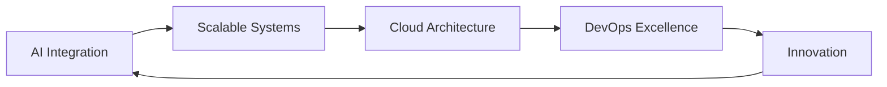

<div align="center">

<!-- Animated Header -->


<!-- Animated Typing Text -->
<a href="https://git.io/typing-svg"></a>

<!-- Profile Views Counter with Animation -->
<p align="center">
  
  
  
</p>

---

<!-- Animated Divider -->


</div>

## 🎯 **Elite Developer | Problem Solver | Innovation Driver**

```typescript
const asish = {
    education: "B.Tech EE @ NIT Durgapur 🎓",
    achievement: "Smart India Hackathon 2024 Winner 🏆",
    role: "Full-Stack Developer",
    focus: ["Mobile Development", "Web Applications", "AI Integration"],
    currentlyExploring: ["Artificial Intelligence", "Scalable Backend Systems", "Cloud Architecture"],
    philosophy: "Code with Purpose, Build with Passion, Scale with Precision"
};
```

<div align="center">

</div>

## 🚀 **About Me**


- 🎓 Pursuing **B.Tech in Electrical Engineering** at **NIT Durgapur**
- 🏆 **Smart India Hackathon 2024 Winner** - Crafted innovative solutions at national level
- 💻 Specialized in **Flutter**, **React**, and **Node.js** ecosystems
- 🔬 Deep diving into **AI/ML integration** and **distributed systems**
- 🎯 Passionate about creating **scalable**, **performant**, and **user-centric** applications
- 🌱 Currently mastering **Cloud Architecture**, **Microservices**, and **DevOps**
- 💡 Always exploring cutting-edge technologies and best practices
- 📫 Let's connect: **asish.maldaitbss@gmail.com**

<br clear="right"/>

<div align="center">

</div>

## 🛠️ **Tech Arsenal**

<div align="center">

### **Languages**
<p>


</p>

### **Frontend Development**
<p>


</p>

### **Backend & Database**
<p>


</p>

### **State Management & Architecture**
<p>


</p>

### **DevOps & Tools**
<p>


</p>

### **AI & Machine Learning**
<p>


</p>

</div>

<div align="center">

</div>

## 📊 **GitHub Analytics**

<div align="center">
  
<!-- GitHub Stats Cards -->


<!-- GitHub Streak Stats -->


<!-- Activity Graph -->


<!-- Trophy Section -->


</div>

<div align="center">

</div>

## 🏆 **Achievements & Highlights**

<div align="center">

| 🎖️ Achievement | 📅 Year | 🔗 Details |
|:---:|:---:|:---|
| 🏆 **SIH Winner** | 2024 | Smart India Hackathon - Built innovative solutions addressing real-world problems |
| 🎓 **NIT Durgapur** | Ongoing | B.Tech in Electrical Engineering at premier technical institute |
| 💼 **Full-Stack Developer** | Present | Expertise in Flutter, React, Node.js ecosystem |
| 🚀 **Open Source** | Ongoing | Contributing to community-driven projects |

</div>

<div align="center">

</div>

## 💼 **What I Bring to the Table**

<table align="center">
<tr>
<td align="center" width="33%">

<h3>Mobile Excellence</h3>
<p>Crafting beautiful, performant cross-platform apps with Flutter. Expert in state management, animations, and native integrations.</p>
</td>
<td align="center" width="33%">

<h3>Web Mastery</h3>
<p>Building scalable web applications with React & Node.js. RESTful APIs, real-time features, and modern architectures.</p>
</td>
<td align="center" width="33%">

<h3>Cloud & DevOps</h3>
<p>Containerization with Docker, CI/CD pipelines, and cloud deployment. Ensuring reliability and scalability.</p>
</td>
</tr>
</table>

<div align="center">

</div>

## 🌟 **Featured Projects**

<div align="center">

[](https://github.com/asishghos)

[](https://github.com/asishghos)

</div>

<div align="center">

</div>

## 📈 **Contribution Calendar**

<div align="center">


</div>

<div align="center">

</div>

## 🤝 **Let's Connect & Collaborate**

<div align="center">

<p>I'm always excited to collaborate on innovative projects, discuss technology, or explore new opportunities!</p>

[](https://www.linkedin.com/in/asish-ghosh-20bb09248)
[](mailto:asish.maldaitbss@gmail.com)
[](https://github.com/asishghos)
[](#)

</div>

<div align="center">

</div>

## 💭 **Developer Quote**

<div align="center">


</div>

<div align="center">

</div>

## 🎯 **Current Focus**



<div align="center">

</div>

## 📊 **Weekly Development Breakdown**

```text
Flutter      ████████████░░░░░░░░░   55%
React        ██████░░░░░░░░░░░░░░░   25%
Node.js      ████░░░░░░░░░░░░░░░░░   15%
DevOps       ██░░░░░░░░░░░░░░░░░░░   05%
```

<div align="center">


### 💙 **Thanks for visiting! Let's build something amazing together!**


</div>
